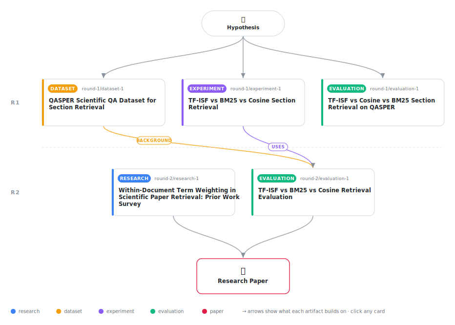

# Within-Document Term Weighting for Scientific Section Retrieval: A Negative Result

<div align="center">

<a href="https://cdn.jsdelivr.net/gh/AMGrobelnik/ai-invention-023b95-within-document-term-weighting-for-scien@main/workflow.svg">
<picture>
  <source media="(prefers-color-scheme: dark)" srcset="workflow-dark.svg">
  
</picture>
</a>

<sub>🖱️ <b><a href="https://cdn.jsdelivr.net/gh/AMGrobelnik/ai-invention-023b95-within-document-term-weighting-for-scien@main/workflow.svg">Open the interactive diagram</a></b> — every card links to its artifact folder.</sub>

</div>

> **TL;DR** — This paper investigates whether within-document Inverse Section Frequency (TF-ISF) can improve section retrieval in scientific papers by applying term-reweighting principles within single documents rather than across corpora. Evaluation on 200 QASPER examples finds TF-ISF achieves F1=0.187, matching cosine similarity (0.198) and BM25 (0.179)—no significant differences (p > 0.37). Critically, the hypothesized mechanism fails: Methods/Results sections have LOWER ISF (1.23–1.24) than Introduction (1.34), falsifying the assumption that evidence sections use more unique vocabulary. We also transparently report a contradictory earlier experiment (n=180, different LLM) showing positive results. The paper contributes a well-characterized negative result: naive within-document term reweighting cannot rescue section retrieval in scientific QA, and future work should target discourse-aware or embedding-based approaches rather than static reweighting heuristics.

<details>
<summary>Full hypothesis</summary>

We originally hypothesized that within-document Inverse Section Frequency (TF-ISF) would correct a systematic retrieval bias favoring claim-dense sections over evidence-dense sections in scientific QA. Two evaluation runs produced contradictory results (n=180: TF-ISF F1=0.221 best; n=200: TF-ISF F1=0.187 worst), and the n=200 run disconfirmed both the performance claim and the proposed mechanism (Methods/Results ISF=1.23–1.24 < Introduction ISF=1.34).

However, the n=200 evaluation has a critical implementation artifact: section text was truncated to 512 characters (~80–100 words) before both embedding and TF-ISF term computation. This systematically discards 70–95% of Methods and Results section content — the very sections the hypothesis targets. This truncation confounds the negative result: (1) the cosine baseline is not a representative dense retrieval baseline; (2) TF-ISF term statistics are computed on artificially impoverished text; and (3) the conclusion that 'dense embedding quality is a bottleneck' is entangled with a data-processing artifact that mimics a quality failure. The 3× recall gap between the two runs (n=180: cosine recall=0.154 vs. n=200: cosine recall=0.467) further signals that the two runs measured fundamentally different retrieval pipelines, not the same method on different samples.

The hypothesis now takes a more conservative, diagnostic form: **the current experimental evidence is insufficient to adjudicate TF-ISF's effectiveness because both runs have confounding artifacts — the n=180 run used a free-tier LLM with high hallucination rates and different evidence matching; the n=200 run truncated section text to 512 characters**. A clean evaluation requires: (1) full section text for TF-ISF and BM25 term statistics, (2) 512-token (not 512-character) truncation for sentence-transformers embedding only, (3) a consistent evidence-matching protocol, and (4) ISF diagnostics computed over all 200 examples rather than the filtered 139-record subset.

Until a clean run is conducted, we can assert the following boundary condition: within-document term reweighting computed on truncated (512-character) section text does not improve over cosine or BM25 on QASPER scientific QA. Whether the failure reflects an intrinsic limitation of TF-ISF or an implementation artifact remains open. The vocabulary stratification hypothesis (Introduction ISF > Methods/Results ISF) is a suggestive empirical finding but is potentially affected by the same truncation bias and the gold-section filtering in the ISF diagnostic.

</details>

[](https://cdn.jsdelivr.net/gh/AMGrobelnik/ai-invention-023b95-within-document-term-weighting-for-scien@main/paper.pdf) [](https://github.com/AMGrobelnik/ai-invention-023b95-within-document-term-weighting-for-scien/tree/main/paper_latex)

This repository contains all **5 artifacts** produced across **2 rounds** of an autonomous AI research run — round by round, exactly in the order they were invented.

## Round 1

| Artifact | Type | Demo | Source | Builds on |
|----------|------|------|--------|-----------|
| **[QASPER Scientific QA Dataset for Section Retrieval](https://github.com/AMGrobelnik/ai-invention-023b95-within-document-term-weighting-for-scien/tree/main/round-1/dataset-1)** | [](https://github.com/AMGrobelnik/ai-invention-023b95-within-document-term-weighting-for-scien/tree/main/round-1/dataset-1) | [](https://colab.research.google.com/github/AMGrobelnik/ai-invention-023b95-within-document-term-weighting-for-scien/blob/main/round-1/dataset-1/demo/data_code_demo.ipynb) | [](https://github.com/AMGrobelnik/ai-invention-023b95-within-document-term-weighting-for-scien/tree/main/round-1/dataset-1/src) | — |
| **[TF-ISF vs BM25 vs Cosine Section Retrieval](https://github.com/AMGrobelnik/ai-invention-023b95-within-document-term-weighting-for-scien/tree/main/round-1/experiment-1)** | [](https://github.com/AMGrobelnik/ai-invention-023b95-within-document-term-weighting-for-scien/tree/main/round-1/experiment-1) | [](https://colab.research.google.com/github/AMGrobelnik/ai-invention-023b95-within-document-term-weighting-for-scien/blob/main/round-1/experiment-1/demo/method_code_demo.ipynb) | [](https://github.com/AMGrobelnik/ai-invention-023b95-within-document-term-weighting-for-scien/tree/main/round-1/experiment-1/src) | — |
| **[TF-ISF vs Cosine vs BM25 Section Retrieval on QASPER](https://github.com/AMGrobelnik/ai-invention-023b95-within-document-term-weighting-for-scien/tree/main/round-1/evaluation-1)** | [](https://github.com/AMGrobelnik/ai-invention-023b95-within-document-term-weighting-for-scien/tree/main/round-1/evaluation-1) | [](https://colab.research.google.com/github/AMGrobelnik/ai-invention-023b95-within-document-term-weighting-for-scien/blob/main/round-1/evaluation-1/demo/eval_code_demo.ipynb) | [](https://github.com/AMGrobelnik/ai-invention-023b95-within-document-term-weighting-for-scien/tree/main/round-1/evaluation-1/src) | — |

## Round 2

| Artifact | Type | Demo | Source | Builds on |
|----------|------|------|--------|-----------|
| **[Within-Document Term Weighting in Scientific Paper Retrieval…](https://github.com/AMGrobelnik/ai-invention-023b95-within-document-term-weighting-for-scien/tree/main/round-2/research-1)** | [](https://github.com/AMGrobelnik/ai-invention-023b95-within-document-term-weighting-for-scien/tree/main/round-2/research-1) | [](https://github.com/AMGrobelnik/ai-invention-023b95-within-document-term-weighting-for-scien/blob/main/round-2/research-1/demo/research_demo.md) | [](https://github.com/AMGrobelnik/ai-invention-023b95-within-document-term-weighting-for-scien/tree/main/round-2/research-1/src) | — |
| **[TF-ISF vs BM25 vs Cosine Retrieval Evaluation](https://github.com/AMGrobelnik/ai-invention-023b95-within-document-term-weighting-for-scien/tree/main/round-2/evaluation-1)** | [](https://github.com/AMGrobelnik/ai-invention-023b95-within-document-term-weighting-for-scien/tree/main/round-2/evaluation-1) | [](https://colab.research.google.com/github/AMGrobelnik/ai-invention-023b95-within-document-term-weighting-for-scien/blob/main/round-2/evaluation-1/demo/eval_code_demo.ipynb) | [](https://github.com/AMGrobelnik/ai-invention-023b95-within-document-term-weighting-for-scien/tree/main/round-2/evaluation-1/src) | <sub><i>uses:</i><br/>[experiment‑1&nbsp;(R1)](https://github.com/AMGrobelnik/ai-invention-023b95-within-document-term-weighting-for-scien/tree/main/round-1/experiment-1)<br/><i>background:</i><br/>[dataset‑1&nbsp;(R1)](https://github.com/AMGrobelnik/ai-invention-023b95-within-document-term-weighting-for-scien/tree/main/round-1/dataset-1)</sub> |

## Repository Structure

Artifacts are grouped by the round of invention that produced them. Each
artifact has its own folder with source code and a self-contained demo:

```
.
├── round-1/                         # One folder per round of invention
│   ├── experiment-1/
│   │   ├── README.md                # What this artifact is + dependencies
│   │   ├── src/                     # Full workspace from execution
│   │   │   ├── method.py            # Main implementation
│   │   │   ├── method_out.json      # Full output data
│   │   │   └── ...                  # All execution artifacts
│   │   └── demo/                    # Self-contained demo
│   │       └── method_code_demo.ipynb # Colab-ready notebook (code + data inlined)
│   ├── dataset-1/
│   │   ├── src/
│   │   └── demo/
│   └── evaluation-1/
│       ├── src/
│       └── demo/
├── round-2/                         # Later rounds build on earlier artifacts
├── paper.pdf                        # Research paper
├── paper_latex/                     # LaTeX source files
├── workflow.svg                     # Artifact dependency diagram (this page's header)
└── README.md
```

## Running Notebooks

### Option 1: Google Colab (Recommended)

Click the "Open in Colab" badges above to run notebooks directly in your browser.
No installation required!

### Option 2: Local Jupyter

```bash
# Clone the repo
git clone https://github.com/AMGrobelnik/ai-invention-023b95-within-document-term-weighting-for-scien
cd ai-invention-023b95-within-document-term-weighting-for-scien

# Install dependencies
pip install jupyter

# Run any artifact's demo notebook
jupyter notebook <artifact_folder>/demo/
```

## Source Code

The original source files are in each artifact's `src/` folder.
These files may have external dependencies - use the demo notebooks for a self-contained experience.

---
*Generated by AI Inventor Pipeline - Automated Research Generation*
